# Practica Docker-Compose
## Iván Pérez Fita
### Introducción

Docker Compose es una herramienta que permite simplificar el uso de Docker, generando scripts que facilitan el diseño y la construcción de servicios. Aquí resumimos algunos tips.

Con Docker Compose puedes crear diferentes contenedores y al mismo tiempo, en cada contenedor, diferentes servicios.

Comandos usados:
- image: Se define la imagen que va a usar el container
- environment: Se definen las variables de entorno
- ports: Se mapean los puertos de la maquina real al container
- networks: Se defines las networks que se van a usar
- volumes: Se definen los volumenes que se van a usar
- healthcheck: Se testea mediante un comando si el container funciona correctamente
- depends on: Se define de que container depende el container
- restart: Se define en que caso hay que reiniciar el contenedor
- logging: Se usa para definir que graylog se usara como sistema de logs para wordpress

Networks y volumenes

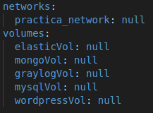

### ElasticSearch

Elasticsearch es un motor de búsqueda que se basa en Lucene el cual nos permite realizar búsquedas por una gran cantidad de datos de un texto específico. Está escrito en Java y se basa sobre una licencia Apache.

En si mismo podríamos definir a Elasticsearch como un base de datos NoSQL orientada a documentos JSON, los cuales pueden ser consultados, creados, actualizados o borrados mediante un un sencillo API Rest.

Características Elasticsearch

Si tuviésemos que definir cuales son las principales características de Elasticsearch podríamos definir las siguientes:

Orientación a Documentos

Indexación

Escalabilidad

Acceso por API

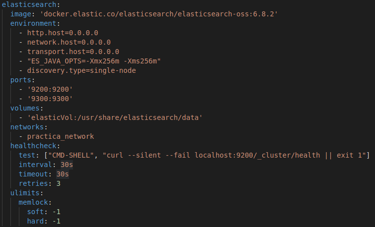

### Mongo

MongoDB es una base de datos orientada a documentos. Esto quiere decir que en lugar de guardar los datos en registros, guarda los datos en documentos. Estos documentos son almacenados en BSON, que es una representación binaria de JSON.

Una de las diferencias más importantes con respecto a las bases de datos relacionales, es que no es necesario seguir un esquema. Los documentos de una misma colección - concepto similar a una tabla de una base de datos relacional -, pueden tener esquemas diferentes.

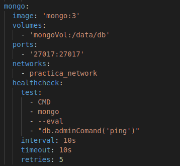

### Graylog

Graylog proporciona un sistema unificado y centralizado de mensajes procedentes de diferentes fuentes: sistema operativo, servidores de aplicación, sistemas de información, etc. Dispone de un sistema de alertas y de búsqueda de histórico de logs usando ElasticSearch como base de datos de índices. De la mano de atSistemas, descubrirás cómo implantar esta solución en entornos complejos: desde la definición de la arquitectura y dimensionamiento de los sistemas que más se ajusta a tus requerimientos, hasta la configuración de los recolectores de mensajes y posterior trasformación para la localización de problemas.

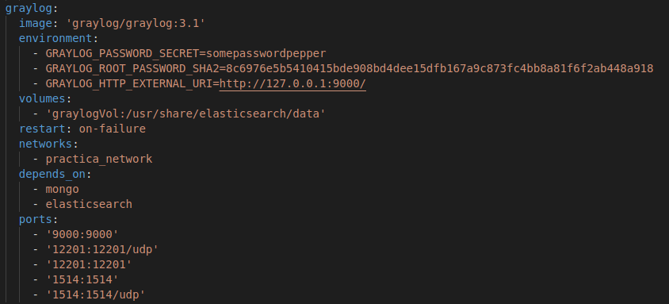

### MySql

MySQL es un sistema de gestión de base de datos relacional (RDBMS) de código abierto, basado en lenguaje de consulta estructurado (SQL).

MySQL se ejecuta en prácticamente todas las plataformas, incluyendo Linux, UNIX y Windows. A pesar de que se puede utilizar en una amplia gama de aplicaciones, MySQL se asocia más con las aplicaciones basadas en la web y la publicación en línea y es un componente importante de una pila empresarial de código abierto llamado LAMP. LAMP es una plataforma de desarrollo web que utiliza Linux como sistema operativo, Apache como servidor web, MySQL como sistema de gestión de base de datos relacional y PHP como lenguaje de programación orientado a objetos (a veces, Perl o Python se utiliza en lugar de PHP).

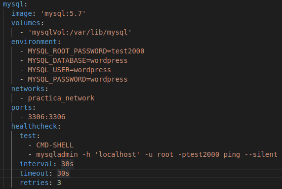

### Wordpress

WordPress es un sistema de gestión de contenidos (CMS) que permite crear y mantener un blog u otro tipo de web.

Con casi 10 años de existencia y más de un millar de temas (plantillas) disponibles en su web oficial, no es solo un sistema sencillo e intuitivo para crear un blog personal, sino que permite realizar toda clase de web más complejas.

WordPress es un sistema ideal para un sitio web que se actualice periódicamente. Si se escribe contenido con cierta frecuencia, cuando alguien accede al sitio web, puede encontrar todos esos contenidos ordenados cronológicamente (primero los más recientes y por último los más antiguos).

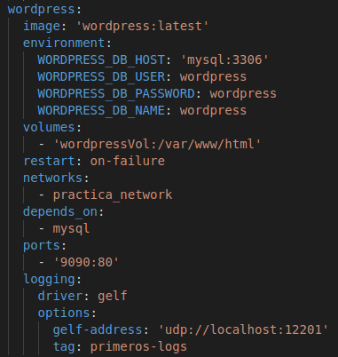

### GELF

El Graylog Extended Log Format (GELF) es una formato que evita los clásicos problemas de logs de sistema. Por ejemplo: No está limitado a 1024 bytes, hay diferentes tipos de datos, hay compresión.

### Monitorización de logs

Instalaremos la pagina de wordpress:

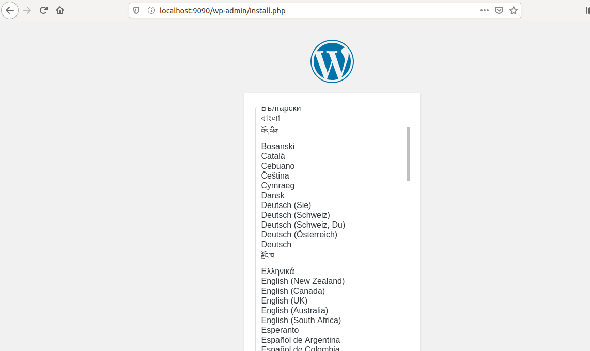

Ahora accedermos al graylog y  añadiremos el input global de tipo GELF UDP.

En el graylog podremos ver que los logs se han actualizado al contener datos

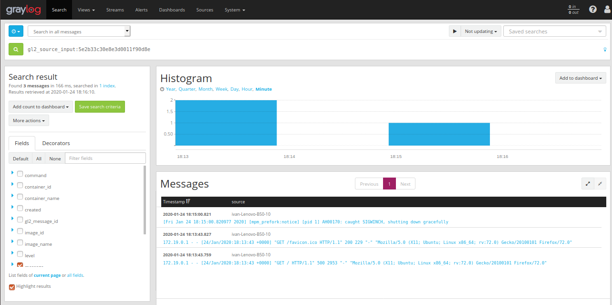

Ahora entraremos al backoffice de wordpress para que haya movimiento en los logs
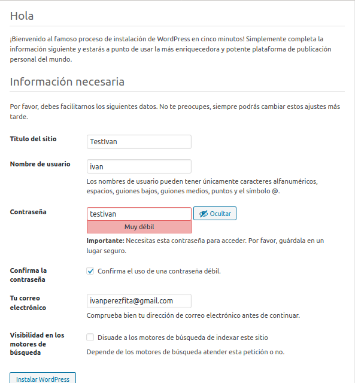

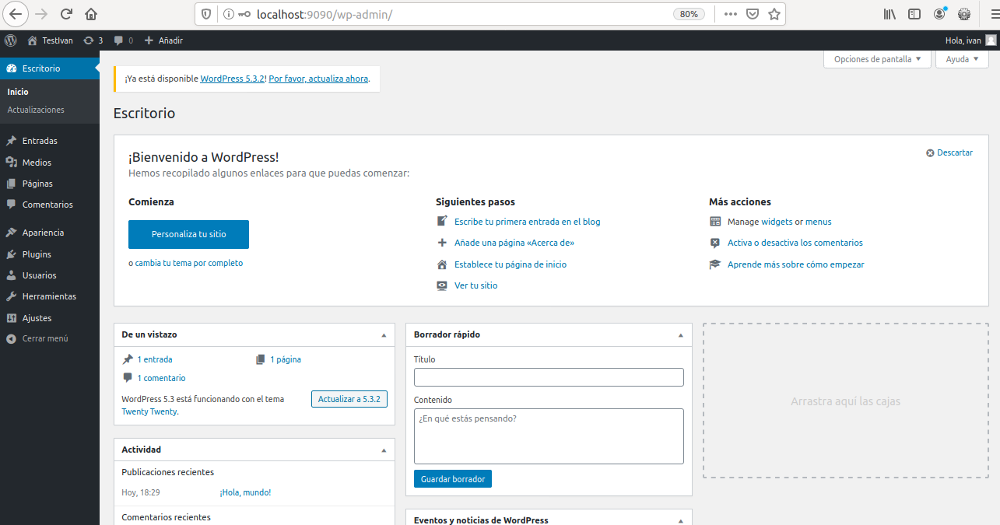

Como podremos observar los datos cambiaran

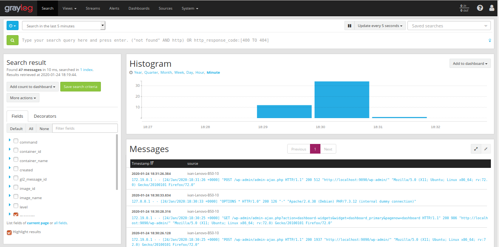